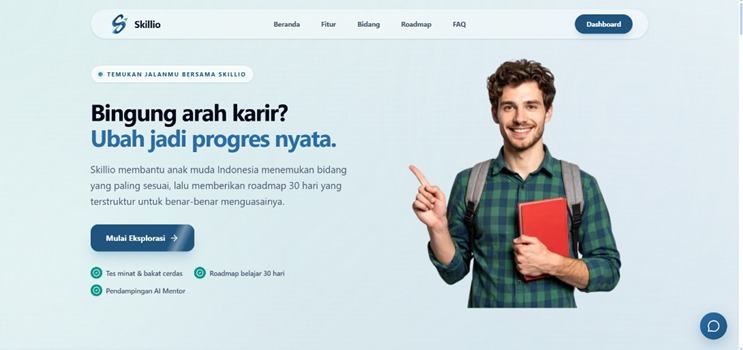
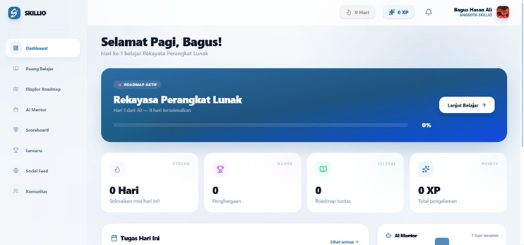
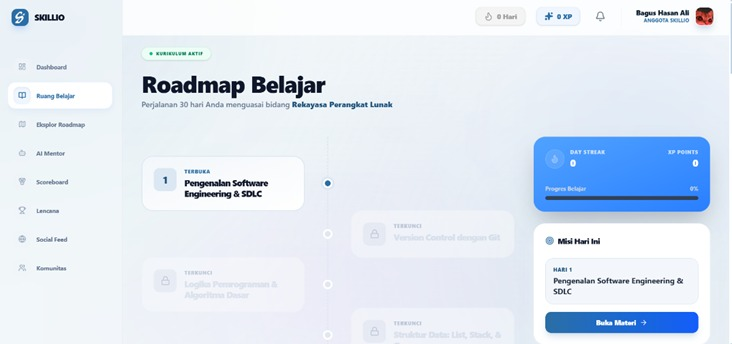

<p align="center">
  
</p>

<h1 align="center">Skillio</h1>

<p align="center">
  <strong>The Future of Career Development Powered by Generative AI</strong>
</p>

<p align="center">
  
  
  
  
</p>

---

## 🚀 Overview

**Skillio** is an AI-driven career pathing and educational platform designed to bridge the gap between education and industry requirements. By leveraging the power of Google Gemini AI, Skillio provides personalized learning roadmaps, interactive competency assessments, and a thriving community for aspiring professionals.

## ✨ Key Features

- 🧠 **AI Career Roadmap**: Personalized 30-day learning paths generated specifically for your career goals.
- 📝 **Intelligent Assessments**: Multi-phase career matching quizzes to find your perfect professional fit.
- 🏆 **Gamification System**: Earn unique badges, maintain streaks, and climb the global leaderboard.
- 💬 **Real-time Community**: Interactive social feed and group chats powered by Pusher for collaborative learning.
- 🎓 **Professional Certification**: Generate and verify competency certificates upon roadmap completion.
- 🎨 **Immersive UI/UX**: A premium, minimalist design featuring smooth animations with Framer Motion and Anime.js.

## 🛠️ Tech Stack

- **Frontend**: [Next.js 16](https://nextjs.org/) (App Router), [React 19](https://react.dev/), [Tailwind CSS 4](https://tailwindcss.com/)
- **State Management**: [Zustand](https://github.com/pmndrs/zustand)
- **Database & ORM**: [PostgreSQL](https://www.postgresql.org/) with [Prisma](https://www.prisma.io/)
- **AI Integration**: [Google Gemini AI API](https://ai.google.dev/)
- **Real-time**: [Pusher](https://pusher.com/)
- **Storage**: [Uploadthing](https://uploadthing.com/)
- **Caching**: [Redis](https://upstash.com/)
- **Animations**: [Framer Motion](https://www.framer.com/motion/), [Anime.js](https://animejs.com/)
- **Authentication**: [Auth.js (NextAuth v5)](https://authjs.dev/)

## 📦 Installation

1. **Clone the repository:**
   ```bash
   git clone https://github.com/WahyuAndikaRahadi/skillio.git
   cd skillio
   ```

2. **Install dependencies:**
   ```bash
   npm install
   ```

3. **Environment Setup:**
   Create a `.env` file in the root directory and add your credentials:
   ```env
   DATABASE_URL="your_postgresql_url"
   NEXTAUTH_SECRET="your_secret"
   GEMINI_API_KEY="your_gemini_key"
   PUSHER_APP_ID="your_pusher_id"
   PUSHER_KEY="your_pusher_key"
   PUSHER_SECRET="your_pusher_secret"
   UPSTASH_REDIS_REST_URL="your_redis_url"
   UPSTASH_REDIS_REST_TOKEN="your_redis_token"
   ```

4. **Database Migration:**
   ```bash
   npx prisma db push
   ```

5. **Run the development server:**
   ```bash
   npm run dev
   ```

<p align="center">
  
  
  
</p>

## 📄 License

This project is licensed under the MIT License - see the [LICENSE](LICENSE) file for details.

---

<p align="center">
  Built with ❤️ by <strong>Team Galatea</strong> for the Competition.
</p>
